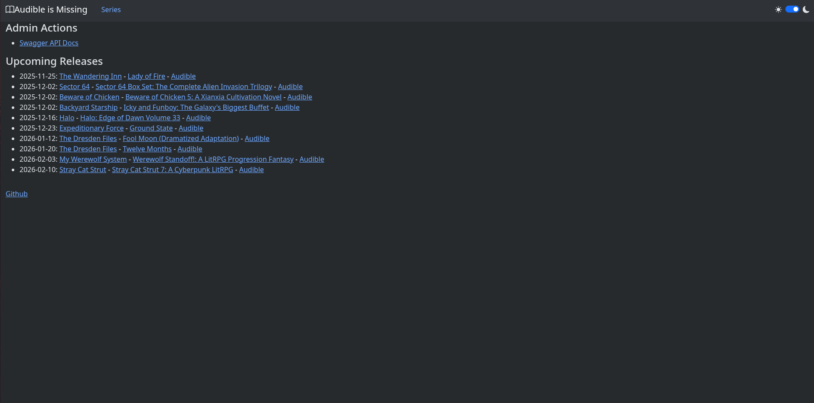
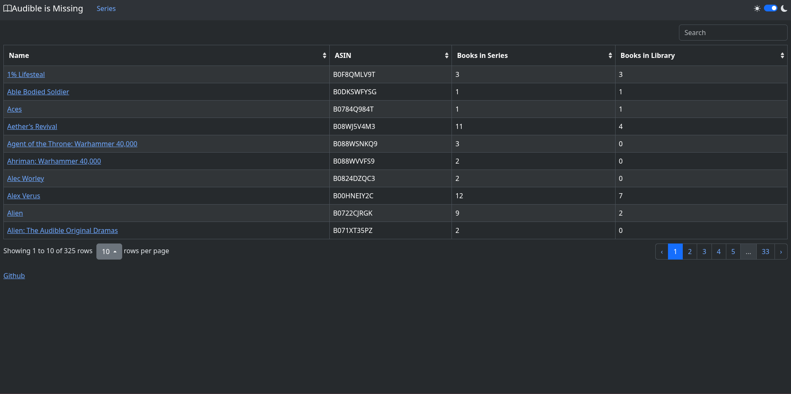
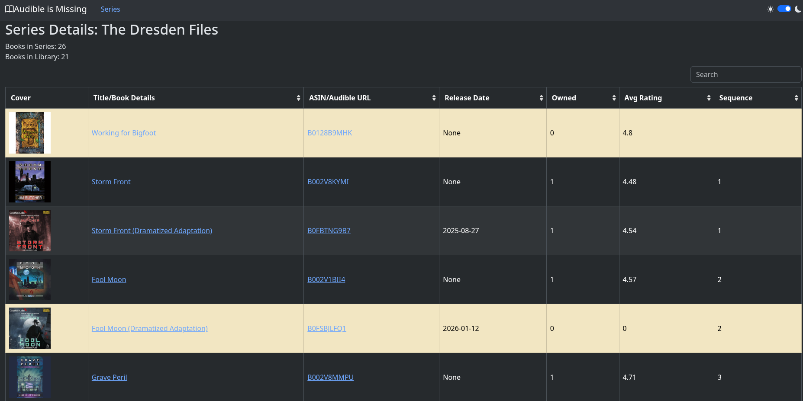
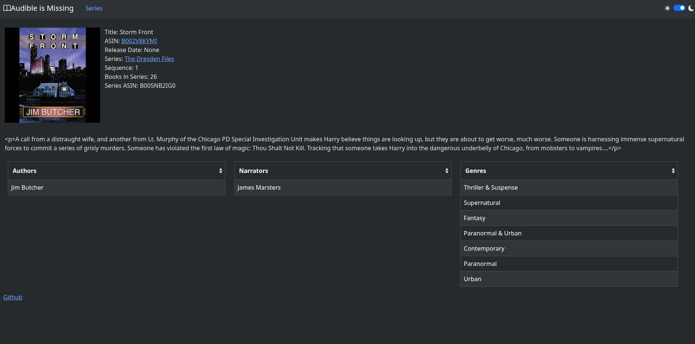

# Audible is Missing

[](https://github.com/audibleismissing/audibleismissing/actions/workflows/docker-image.yml)

## What is this

Ok, so I made this for a couple reasons. One, It was a pain in the ass to keep track of which audiobook series had books coming out using the native audible tools. And no such funcitonality exists in Audiobookshelf. Second, I've never made a web app, so it was a chance to learn how to do that...I learned I don't like html.

This is still in early stages and is also a hobby project. So DO NOT serve this application to the open internet. My code is terrible and probably has lots of issues.

Disclaimer: Yes, I have used AI a little when writing some of this. I'd say it's probably 85-90% hand written and the rest was AI when I got stuck.

Index                      |  Series List
:-------------------------:|:-------------------------:
  |  

Series Details             |  Book Details
:-------------------------:|:-------------------------:
  |  

## Some Notes

- Maximum books returned by audible api is 50 (hard limit). So some series data might not be complete.
- The method used for getting books in a series sometimes decides to add invalid book asins or just omits them from the results. An example of this is book 3 in Beware of Chicken. To "kinda" fix this, I implemented a work around. See [Issue 35](https://github.com/tupcakes/audibleismissing/issues/35). Because of this, it's possible that some series books might be missed. I largely hasn't been an issue though.
- Yes, there are probably ways I could write this to be more efficent. I'm a noob when it comes to python and programming isn't my normal career choice. Essentially, yes my code sucks but I'm learning.

## Features

### Existing

- Settings page for audible authentication and audiobookshelf authentication
- At a glance, soon to be released list based off your library.
- Series list (searchable)
- Series details with list of searchable books. (has ratings)
- Book details page contains general info about a book.
- Series watch list.
- Book wish list.
- Import/Export database to json
- Manual or scheduled refresh cycle. (scheduled is currently between 12am - 2am utc)

### Possible Features

Some stuff I'm considering implementing.

- Importing other books by existing authors for book discovery.
- Narrator and author details lists.
- Manually adding series.

## Install

### docker compose

```compose.yaml
services:
  audibleismissing:
    container_name: audibleismissing
    image: ghcr.io/audibleismissing/audibleismissing:latest
    ports:
      - 8000:8000
    volumes:
      - ../config:/config
    environment:
      - ALLOWED_ORIGINS="https://aim.example.com" # Set if running on something other than localhost or 127.0.0.1
```

## Tech Stack

- FastAPI
- SQLite
- Bootstrap
- bootstrap-table
- bootstrap-icons
- jquery

## Dev Environment Setup

### Requirements

- Python
- uv

### Mirroring

```bash
git clone https://github.com/audibleismissing/audibleismissing.git
cd audibleismissing
uv sync
```

### Running

Dev

```bash
uv run fastapi dev main.py
```

Prod

```bsh
uv run fastapi run main.py
```

### Docker dev (prefered)

`sh build.sh`

## run linter

```bash
uv run ruff format
Optional: uv run ruff check --fix
```
